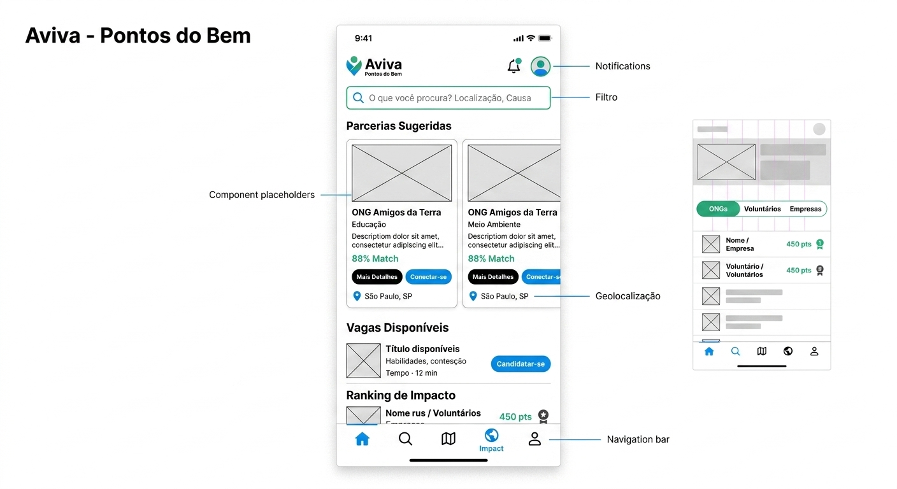
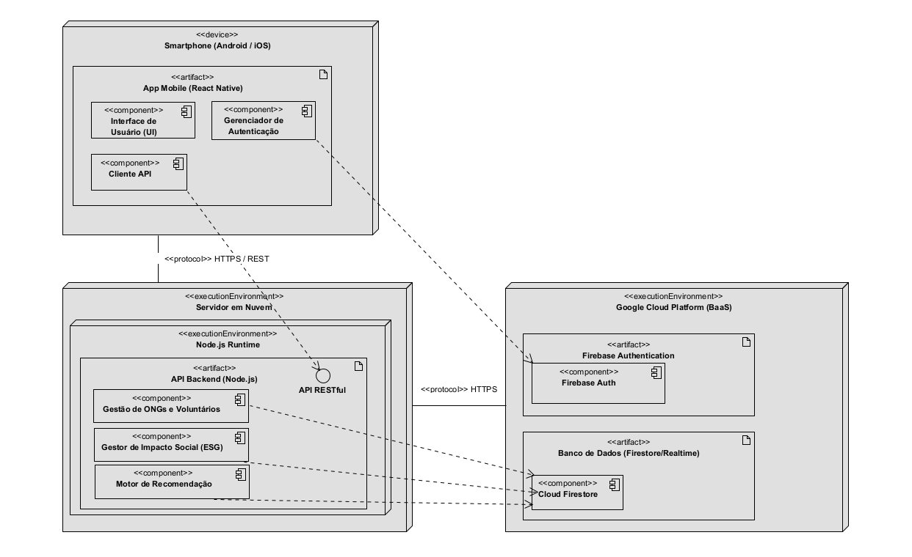
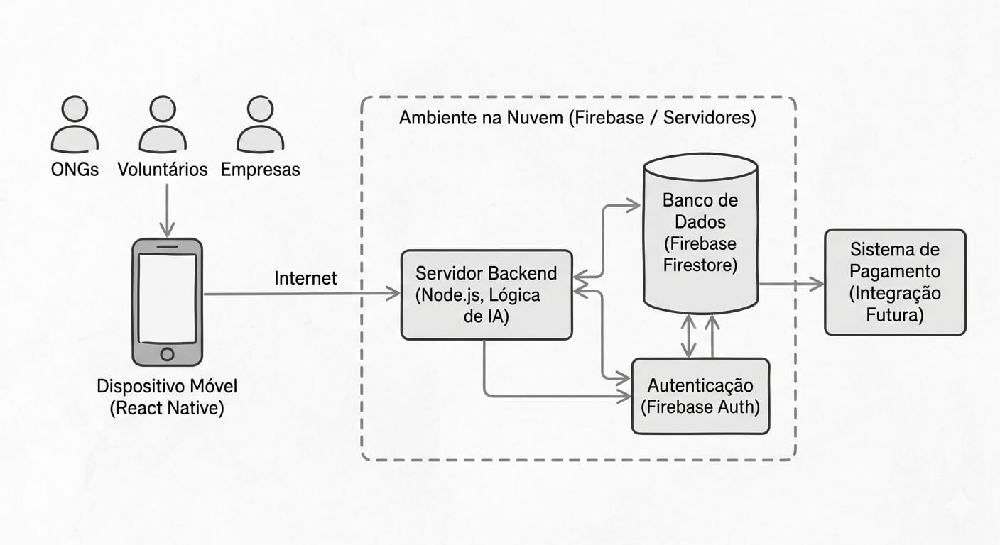

# Aviva - Pontos do Bem
O Aviva é uma plataforma digital focada em unir Organizações Não Governamentais (ONGs), voluntários e empresas em um único ambiente colaborativo e de fácil acesso. O objetivo do sistema é atuar como um facilitador de responsabilidade social, centralizando e democratizando o acesso a ferramentas de gestão que hoje são fragmentadas ou de alto custo. A criação da rede permitirá maior visibilidade para os projetos sociais, atração inteligente de parceiros e a otimização de tempo e recursos para todos os envolvidos.
A iniciativa apoia fortemente a Agenda 2030 da ONU, com foco central no Objetivo de Desenvolvimento Sustentável (ODS) 17, que busca o fortalecimento de parcerias e meios de implementação.

## Histórico
A ideia de criar o Aviva  nasceu da observação acadêmica sobre o Terceiro Setor brasileiro no desenvolvimento do nosso Projeto Integrador. A percepção geral foi que, apesar de existirem milhares de ONGs realizando trabalhos vitais, a falta de digitalização e recursos inibe a sobrevivência e o crescimento dessas instituições.
Notamos que existe uma "demanda reprimida": muitas pessoas e corporações querem ajudar, mas as ferramentas tecnológicas atuais são descentralizadas. Atualmente, o ecossistema exige que se use uma plataforma para mobilizar voluntários, outra para doações financeiras e mais outra para gerar relatórios de transparência. Essa fragmentação gera um esforço duplicado e afasta potenciais parceiros.

## Modelo
Experiências no mercado global, como o software canadense Benevity (referência no setor corporativo), possuem um modelo de controle excelente, porém com custo altíssimo e foco apenas em multinacionais. Ferramentas nacionais como Atados e Ribon cobrem apenas partes isoladas do processo.
O caminho adotado pelo Aviva é o de **Centralização do Ecossistema**. O nosso diferencial é simplificar essa ponte de ponta a ponta, oferecendo em um único lugar o gerenciamento de campanhas, engajamento prático mão na massa e controle métrico.

## Formas de Participação
Os atores que compõem o ecossistema do Aviva interagem sob os seguintes perfis:
 * **ONGs (Terceiro Setor):** Recebem um painel de ações para cadastramento de eventos, vagas de voluntariado e campanhas de arrecadação, ganhando vitrine e suporte de gestão.
   
 * **Voluntários (Pessoas Físicas):** Têm acesso facilitado e ágil (cadastro em menos de 2 minutos) para encontrar causas por geolocalização e "dar match" doando seu tempo ou habilidades específicas.
   
 * **Empresas (Setor Privado):** Têm acesso a geração de relatórios de impacto de suas ações (Métricas ESG) e orientação sobre incentivos fiscais para estruturar sua Responsabilidade Social Empresarial de forma independente.

## Projeto e Plano de Trabalho
O Aviva é um Projeto Integrador (PI) ideaizado por alunas do curso de Análise e Desenvolvimento de Sistemas (AMS) da FATEC Zona Leste. Como o projeto está em sua fase inicial, o plano de trabalho adota metodologias ágeis e iterativas, com as seguintes etapas:
 1. **Fundamentação e Benchmarking:** Mapeamento de concorrentes, análise SWOT e viabilidade (Concluído).
 2. **Prototipação e Design (UX/UI):** Desenho das telas no Figma e testes em laboratório (Em Andamento).
 3. **Desenvolvimento do MVP:** Construção inicial da infraestrutura de código utilizando versionamento no GitHub.
 4. **Lançamento Oficial Inicial:** Previsão de entrada em produção de forma restrita, focando em cadastrar até 50 ONGs pioneiras.
 5. **Expansão (Futuro):** Integração com sistemas de pagamento direto e painéis avançados de impacto.
    
## Tecnologia e Acesso aos Dados
Para garantir a facilidade de uso – permitindo que até ONGs com baixo letramento digital utilizem a plataforma de forma fluida nos celulares –, o Aviva emprega uma pilha de tecnologias modernas e leves:
 * **Front-end & Back-end:** Interface construída com **React Native** e lógica estruturada em **Node.js**.
 * **Banco de Dados & Nuvem:** Todo o armazenamento, regras de cadastro e segurança operam hospedados via **Firebase**.
 * **Assistente de Match (IA):** O núcleo inteligente do sistema atuará rastreando os interesses e habilidades declarados pelos voluntários e empresas, cruzando-os com as demandas das ONGs e emitindo notificações dinâmicas de conexão.

https://www.figma.com/team_invite/redeem/ftTJuakpvc2KcnhCnmtMav?t=2LOvTr6cmx9lM8q3-21 

## Equipe
Projeto concebido, pesquisado e desenvolvido pelas alunas:
 * Desirée Constantino
 * Isabelle Gomes
 * Nicole Milanez
